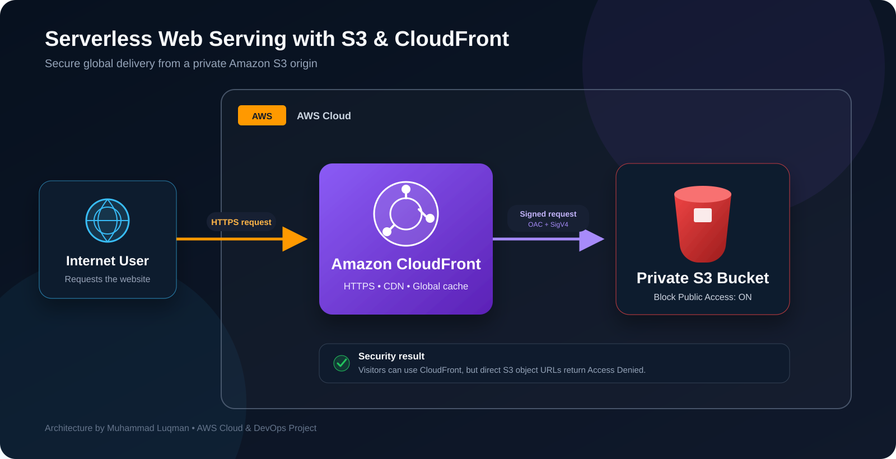

# Serverless Web Serving with S3 & CloudFront

Production-style static website hosting based on this architecture:



CloudFront serves the website globally over HTTPS. The S3 bucket remains private and accepts reads only from the created CloudFront distribution.

## AWS services

- Amazon S3 — private website asset storage
- Amazon CloudFront — CDN, HTTPS, compression and caching
- AWS CloudFormation — repeatable infrastructure deployment
- AWS Identity and Access Management — least-privilege bucket policy

The included frontend is built with semantic HTML5, a separate responsive CSS stylesheet, and lightweight JavaScript. It includes an AWS-themed hero, animated architecture flow, service cards, mobile breakpoints, hover states, and accessible navigation.

## Security and cost controls

- S3 Block Public Access is enabled on all four settings.
- S3 Object Ownership is set to `BucketOwnerEnforced`; ACLs are disabled.
- CloudFront uses Origin Access Control (SigV4), not the legacy OAI approach.
- The bucket policy is restricted to the exact CloudFront distribution ARN.
- TLS 1.2 or newer is required.
- No credentials or account identifiers are stored in the repository.
- The included cleanup script removes uploaded objects before deleting the stack.

> AWS Free Tier eligibility varies by account and time. Review the AWS Pricing pages and Billing dashboard before deployment. CloudFront and S3 usage can create charges.

## Project structure

```text
serverless-web-serving-s3-cloudfront/
├── docs/
│   ├── BEGINNER_AWS_CONSOLE_GUIDE.md
│   └── STEP_BY_STEP.md
├── infrastructure/
│   └── template.yaml
├── scripts/
│   ├── deploy.sh
│   └── destroy.sh
├── website/
│   ├── error.html
│   ├── index.html
│   ├── script.js
│   └── styles.css
├── preview.html                # Self-contained colored preview
├── .gitignore
├── LICENSE
└── README.md
```

## How we built it

The project was created in these stages:

1. Designed the user → CloudFront → private S3 architecture.
2. Built the responsive frontend with HTML, CSS, and JavaScript.
3. Defined an encrypted, versioned, non-public S3 bucket in CloudFormation.
4. Added CloudFront Origin Access Control with SigV4 signing.
5. Configured the CloudFront distribution for HTTPS, caching, compression, HTTP/2, and HTTP/3.
6. Added a least-privilege bucket policy restricted to the exact distribution.
7. Added stack outputs for the bucket, distribution, domain, and website URL.
8. Automated deployment, file synchronization, cache invalidation, and cleanup.
9. Added verification and secret-scanning checks.

Read the complete walkthrough in [`docs/STEP_BY_STEP.md`](docs/STEP_BY_STEP.md).

If you are completely new to AWS, follow the click-by-click guide: [`docs/BEGINNER_AWS_CONSOLE_GUIDE.md`](docs/BEGINNER_AWS_CONSOLE_GUIDE.md). It starts with opening the AWS Console and explains every S3 and CloudFront screen in simple words.

## Prerequisites

1. An AWS account with billing alerts configured.
2. AWS CLI v2 installed and authenticated.
3. Permission to manage CloudFormation, S3, CloudFront and related IAM policies.

Verify authentication:

```bash
aws sts get-caller-identity
```

## Deploy

From the project root:

```bash
chmod +x scripts/*.sh
./scripts/deploy.sh
```

The script will:

1. Deploy the CloudFormation stack.
2. Upload the website files to the private S3 bucket.
3. Create a CloudFront invalidation.
4. Print the HTTPS website URL.

CloudFront deployment can take several minutes.

## Manual deployment

```bash
aws cloudformation deploy \
  --template-file infrastructure/template.yaml \
  --stack-name serverless-web-serving-s3-cloudfront

BUCKET_NAME=$(aws cloudformation describe-stacks \
  --stack-name serverless-web-serving-s3-cloudfront \
  --query "Stacks[0].Outputs[?OutputKey=='BucketName'].OutputValue" \
  --output text)

aws s3 sync website/ "s3://${BUCKET_NAME}/" --delete
```

## Update the website

Edit files in `website/`, then run `./scripts/deploy.sh` again. The script synchronizes files and invalidates the CloudFront cache.

## Cleanup

To avoid ongoing charges:

```bash
./scripts/destroy.sh
```

The cleanup script empties the versioned bucket, including old object versions and delete markers, and then deletes the CloudFormation stack.

## Verification checklist

- Open the `WebsiteURL` stack output and confirm the page loads over HTTPS.
- Opening the S3 object URL directly should return `AccessDenied`.
- Confirm S3 Block Public Access is enabled.
- Confirm CloudFront is using the `redirect-to-https` viewer protocol policy.
- Run the cleanup script when the lab is complete.

## Suggested issue proposal

**Title:** Add a secure CloudFront and S3 static website project

**Summary:** Build a production-style static website with a private S3 origin, CloudFront Origin Access Control, HTTPS enforcement, Infrastructure as Code, and documented cleanup steps.

## Author

Muhammad Luqman — AWS Cloud & DevOps Learner
