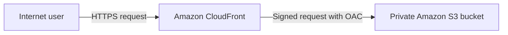

# Step-by-Step Build Guide

This guide explains how the **Serverless Web Serving with S3 & CloudFront** project was designed and built. It documents the code in this repository rather than requiring manual creation of resources in the AWS Console.

## 1. Define the architecture

The request path is deliberately small:



The browser never reads the bucket directly. CloudFront is the only public entry point.

## 2. Build the frontend

The website assets were created inside `website/`:

- `index.html` provides the page structure and content.
- `styles.css` provides the AWS-inspired colors, responsive layout, cards and animations.
- `script.js` adds smooth navigation and the current year.
- `error.html` provides a simple not-found page.

The frontend has no server process and no database dependency, so static object storage is sufficient.

## 3. Start the CloudFormation template

`infrastructure/template.yaml` begins with a template version and description. A `PriceClass` parameter lets the deployer choose the set of CloudFront edge locations without changing the template.

## 4. Create and secure the S3 bucket

The `WebsiteBucket` resource creates the storage origin. It enables:

- AES-256 server-side encryption
- S3 Versioning
- `BucketOwnerEnforced` object ownership
- All four S3 Block Public Access controls

There is intentionally no `WebsiteConfiguration` property. That property would use the public S3 website endpoint, which does not support the private OAC design used here.

## 5. Create CloudFront Origin Access Control

The `CloudFrontOAC` resource creates an Origin Access Control with:

- Origin type: `s3`
- Signing behavior: `always`
- Signing protocol: AWS Signature Version 4

This lets CloudFront authenticate to S3 without making the bucket public.

## 6. Create the CloudFront distribution

The `CloudFrontDistribution` resource uses the S3 regional domain name as its origin. Its important settings are:

- Default root object: `index.html`
- Viewer protocol policy: `redirect-to-https`
- Allowed methods: `GET`, `HEAD`, and `OPTIONS`
- Compression enabled
- Managed caching policy
- HTTP/2 and HTTP/3 enabled
- Minimum TLS protocol: `TLSv1.2_2021`

CloudFront's default certificate provides HTTPS for the generated `cloudfront.net` domain.

## 7. Apply the least-privilege bucket policy

`WebsiteBucketPolicy` allows the CloudFront service principal to perform only `s3:GetObject`.

The `AWS:SourceArn` condition restricts access to the exact distribution created by this stack. Another CloudFront distribution cannot use this permission.

## 8. Export useful stack outputs

The template returns:

- S3 bucket name
- CloudFront distribution ID
- CloudFront domain name
- Complete HTTPS website URL

The deployment script reads these outputs instead of hardcoding resource identifiers.

## 9. Deploy the infrastructure

First authenticate the AWS CLI and confirm the active identity:

```bash
aws sts get-caller-identity
```

Then run:

```bash
chmod +x scripts/*.sh
./scripts/deploy.sh
```

The script calls `aws cloudformation deploy` and waits for CloudFormation to create the resources.

## 10. Upload the website

After the stack is ready, `deploy.sh` reads the bucket name and synchronizes the local assets:

```bash
aws s3 sync website/ "s3://${BUCKET_NAME}/" --delete
```

The bucket can receive this upload through the deployer's authenticated AWS CLI session while remaining blocked from anonymous public access.

## 11. Refresh the CloudFront cache

The script creates an invalidation for `/*`. This tells CloudFront to retrieve the latest uploaded files instead of waiting for older cached copies to expire.

## 12. Verify the result

Use the `WebsiteURL` CloudFormation output and check:

1. The website opens over HTTPS.
2. The page is styled and responsive.
3. An S3 object URL opened directly returns `AccessDenied`.
4. S3 Block Public Access shows all controls enabled.
5. The CloudFront origin shows Origin Access Control.

## 13. Update the website

Edit the files under `website/` and run `./scripts/deploy.sh` again. CloudFormation reports no infrastructure changes, the script uploads the changed assets, and a new invalidation refreshes the cache.

## 14. Clean up all resources

Run:

```bash
./scripts/destroy.sh
```

Because the bucket uses versioning and a retain policy for safety, the script removes current objects, previous versions, and delete markers before deleting the CloudFormation stack.

## What this project demonstrates

- Serverless static web hosting
- Content delivery through a global CDN
- Private S3 origin security
- Least-privilege resource policies
- Repeatable Infrastructure as Code
- Automated deployment and cleanup
- Cost-conscious AWS lab practices

